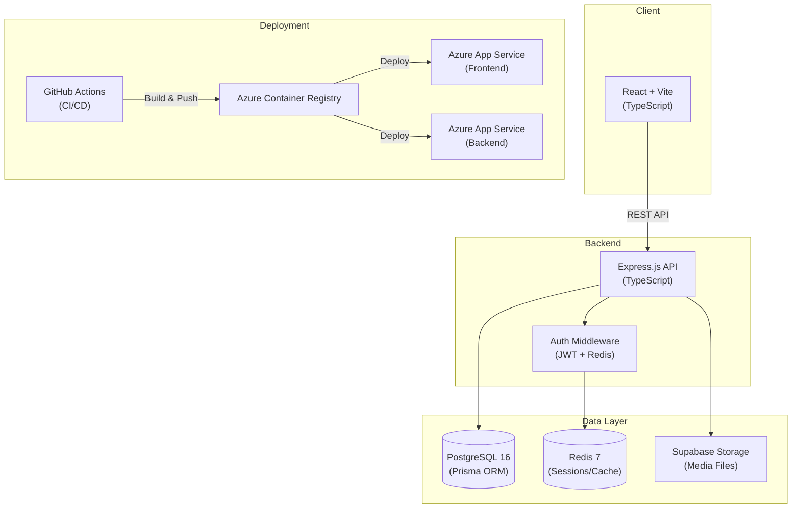

<div align="center">

# 📘 Facebook Clone — Feature Implementation

**A full-stack social media platform** built as part of the **CSE-326 Information System Design** course.  
Implements core Facebook features: posts, comments, reactions, notifications, feeds, search, and media uploads.

[](https://nodejs.org)
[](https://www.typescriptlang.org)
[](https://react.dev)
[](https://www.prisma.io)
[](https://www.postgresql.org)
[](https://www.docker.com)
[](https://azure.microsoft.com)
[](./LICENSE)

</div>

---

## ✨ Features

| Feature | Description |
|---|---|
| 🔐 **Authentication** | JWT-based auth with access/refresh tokens, Redis-backed token blacklisting |
| 📝 **Posts** | Create, edit, delete posts with text, images, and videos |
| 💬 **Comments** | Threaded comments with CRUD operations and counts |
| ❤️ **Reactions** | 6 reaction types (Like, Love, Haha, Wow, Sad, Angry) — toggle/switch behavior |
| 📰 **Feed** | Algorithmic engagement-scored feed with cursor-based pagination |
| 🔔 **Notifications** | Real-time notification system for reactions and comments |
| 🔍 **Search** | Full-text search across users and public posts |
| 📁 **Media Upload** | Image/video uploads via Supabase Storage (10 MB limit) |
| 🔖 **Saved Posts** | Bookmark posts for later reading |
| 🚫 **Block/Unblock** | User blocking with automatic content filtering |
| 🔒 **Privacy Controls** | Per-user privacy settings for posts, friend requests, and friends list |
| 🔄 **Post Sharing** | Share posts with engagement tracking |

---

## 🏗️ Architecture



---

## 🛠️ Tech Stack

### Frontend
| Technology | Purpose |
|---|---|
| **React 19** | UI component framework |
| **Vite 6** | Build tool and dev server |
| **TypeScript 5.7** | Type safety |
| **React Router 7** | Client-side routing |
| **Axios** | HTTP client with interceptors |
| **React Icons** | Icon library |

### Backend
| Technology | Purpose |
|---|---|
| **Node.js 20** | Runtime environment |
| **Express 4** | HTTP framework |
| **TypeScript 5.7** | Type safety |
| **Prisma 6** | Database ORM and migrations |
| **Zod** | Request validation |
| **JWT (jsonwebtoken)** | Authentication tokens |
| **bcryptjs** | Password hashing |
| **ioredis** | Redis client for caching/sessions |
| **Multer** | File upload middleware |
| **Helmet** | Security headers |
| **Morgan** | HTTP request logging |

### Infrastructure
| Technology | Purpose |
|---|---|
| **PostgreSQL 16** | Primary database |
| **Redis 7** | Token blacklisting and caching |
| **Supabase** | Object storage for media |
| **Docker** | Containerization |
| **Nginx** | Frontend static file server |
| **Azure App Service** | Cloud hosting |
| **Azure Container Registry** | Docker image store |
| **GitHub Actions** | CI/CD pipeline |

### Testing
| Technology | Purpose |
|---|---|
| **Jest 29** | Test runner |
| **Supertest 7** | HTTP integration tests |
| **ts-jest** | TypeScript support for Jest |

---

## 📂 Project Structure

```
9.Facebook-Feat-Impl/
├── .github/workflows/
│   └── deploy.yml              # GitHub Actions CI/CD pipeline
├── backend/
│   ├── prisma/
│   │   └── schema.prisma       # Database schema (7 models, 2 enums)
│   └── src/
│       ├── __tests__/           # Jest + Supertest integration tests
│       │   ├── setup.ts         # Test database setup & teardown
│       │   ├── auth.test.ts     # Authentication flow tests
│       │   ├── post.test.ts     # Post CRUD tests
│       │   ├── comment.test.ts  # Comment CRUD tests
│       │   ├── reaction.test.ts # Reaction toggle tests
│       │   └── feed.test.ts     # Feed algorithm & pagination tests
│       ├── config/              # Database, Redis, Supabase clients
│       ├── controllers/         # Route handlers with Zod validation
│       ├── middleware/          # Auth (JWT) & error handling
│       ├── routes/              # Express route definitions
│       ├── services/            # Business logic layer
│       ├── types/               # TypeScript declarations
│       ├── utils/               # JWT & password helpers
│       ├── app.ts               # Express app configuration
│       └── index.ts             # Server entry point
├── frontend/
│   └── src/
│       ├── api/                 # Axios API client modules
│       ├── components/          # Reusable React components
│       ├── contexts/            # Auth context provider
│       ├── pages/               # Route page components
│       ├── App.tsx              # Root component with routing
│       └── index.css            # Global styles
├── Dockerfile.backend           # Multi-stage Node.js build
├── Dockerfile.frontend          # Multi-stage Vite → Nginx build
├── nginx.conf                   # SPA-aware Nginx configuration
├── docker-compose.yml           # Development services (DB + Redis)
├── docker-compose.prod.yml      # Full production stack
├── .env.example                 # Environment variables template
└── AZURE_DEPLOYMENT.md          # Azure deployment guide
```

---

## 📡 API Reference

All endpoints are prefixed with `/api/v1`. Protected routes require `Authorization: Bearer <token>`.

### Authentication
| Method | Endpoint | Auth | Description |
|---|---|---|---|
| `POST` | `/auth/register` | ✗ | Register a new user |
| `POST` | `/auth/login` | ✗ | Login and get tokens |
| `POST` | `/auth/refresh` | ✗ | Refresh access token |
| `POST` | `/auth/logout` | ✓ | Invalidate current token |

### Posts
| Method | Endpoint | Auth | Description |
|---|---|---|---|
| `POST` | `/posts` | ✓ | Create a new post |
| `GET` | `/posts/:postId` | ✓ | Get a single post |
| `PATCH` | `/posts/:postId` | ✓ | Update own post |
| `DELETE` | `/posts/:postId` | ✓ | Delete own post |

### Comments
| Method | Endpoint | Auth | Description |
|---|---|---|---|
| `GET` | `/posts/:postId/comments` | ✓ | List comments (cursor pagination) |
| `POST` | `/posts/:postId/comments` | ✓ | Add a comment |
| `PATCH` | `/posts/:postId/comments/:commentId` | ✓ | Edit own comment |
| `DELETE` | `/posts/:postId/comments/:commentId` | ✓ | Delete own comment |

### Reactions
| Method | Endpoint | Auth | Description |
|---|---|---|---|
| `POST` | `/posts/:postId/reactions` | ✓ | Toggle post reaction |
| `GET` | `/posts/:postId/reactions` | ✓ | Get post reactions |
| `POST` | `/comments/:commentId/reactions` | ✓ | Toggle comment reaction |

### Feed & Search
| Method | Endpoint | Auth | Description |
|---|---|---|---|
| `GET` | `/feed?limit=20&cursor=` | ✓ | Get algorithmic feed |
| `GET` | `/search?q=&type=all&page=1` | ✓ | Search users and posts |

### Users
| Method | Endpoint | Auth | Description |
|---|---|---|---|
| `GET` | `/users/:userId` | ✓ | Get user profile |
| `PUT` | `/users/:userId` | ✓ | Update profile |
| `GET` | `/users/:userId/posts` | ✓ | Get user's posts |
| `POST` | `/users/:userId/saved-posts/:postId` | ✓ | Save a post |
| `DELETE` | `/users/:userId/saved-posts/:postId` | ✓ | Unsave a post |
| `GET` | `/users/:userId/saved-posts` | ✓ | Get saved posts |
| `POST` | `/users/:userId/block` | ✓ | Block a user |
| `DELETE` | `/users/:userId/block/:blockedId` | ✓ | Unblock a user |
| `GET` | `/users/:userId/blocked` | ✓ | Get blocked users |

### Notifications
| Method | Endpoint | Auth | Description |
|---|---|---|---|
| `GET` | `/notifications` | ✓ | Get notifications (paginated) |
| `GET` | `/notifications/unread-count` | ✓ | Get unread count |
| `PUT` | `/notifications/:id/read` | ✓ | Mark one as read |
| `PUT` | `/notifications/read-all` | ✓ | Mark all as read |

### Storage
| Method | Endpoint | Auth | Description |
|---|---|---|---|
| `POST` | `/storage/upload` | ✓ | Upload media file (10 MB max) |

---

## 🚀 Getting Started

### Prerequisites

- **Docker Desktop** — for PostgreSQL and Redis
- **Node.js 18+** — runtime
- **npm** — package manager
- **Supabase account** — for media uploads (free tier works)

### 1. Clone & Configure

```bash
git clone <repo-url>
cd 9.Facebook-Feat-Impl

# Copy environment template
cp .env.example backend/.env
```

Edit `backend/.env` and fill in your secrets:
```bash
JWT_ACCESS_SECRET="<generate-a-64-byte-hex>"    # node -e "console.log(require('crypto').randomBytes(64).toString('hex'))"
JWT_REFRESH_SECRET="<generate-a-64-byte-hex>"
SUPABASE_URL="https://your-project.supabase.co"
SUPABASE_KEY="your-service-role-key"
```

### 2. Start Database & Cache

```bash
docker-compose up -d
```
This starts **PostgreSQL** on port `5433` and **Redis** on port `6380`.

### 3. Run Backend

```bash
cd backend
npm install
npx prisma migrate dev    # Create tables
npm run dev                # Start dev server (port 8080)
```

### 4. Run Frontend

```bash
cd frontend
npm install
npm run dev                # Start Vite dev server (port 5173)
```

Your app is now live at **http://localhost:5173** 🎉

---

## 🐳 Production Docker Deployment

Build and start the entire stack locally:

```bash
docker-compose -f docker-compose.prod.yml up -d --build
```

| Service | URL |
|---|---|
| Frontend (Nginx) | http://localhost:80 |
| Backend API | http://localhost:8080 |
| PostgreSQL | localhost:5432 |
| Redis | localhost:6379 |

---

## ☁️ Azure Cloud Deployment

See [AZURE_DEPLOYMENT.md](./AZURE_DEPLOYMENT.md) for the full step-by-step guide covering:

1. **Azure Database for PostgreSQL** (managed DB)
2. **Azure Cache for Redis** (managed cache)
3. **Azure Container Registry** (private Docker images)
4. **Azure App Service** (container hosting)
5. **GitHub Actions** (automated CI/CD pipeline)

---

## 🧪 Testing

The backend includes a comprehensive integration test suite using **Jest** and **Supertest**.

### Run Tests

```bash
cd backend
npm test    # Runs jest --runInBand --forceExit
```

### Test Coverage

| Suite | Tests | Coverage |
|---|---|---|
| **Auth** | Register, login, refresh, logout, validation | 9 tests |
| **Posts** | CRUD, authorization, pagination | 8 tests |
| **Comments** | Add, edit, delete, count tracking | 6 tests |
| **Reactions** | Toggle, switch type, remove, counts | 6 tests |
| **Feed** | Algorithm, privacy filtering, cursor pagination | 4 tests |

> **Note:** Tests require a running PostgreSQL instance (the test setup uses `localhost:5432` by default). Run `docker-compose up -d` first.

---

## 📝 License

This project is licensed under the [MIT License](./LICENSE).
