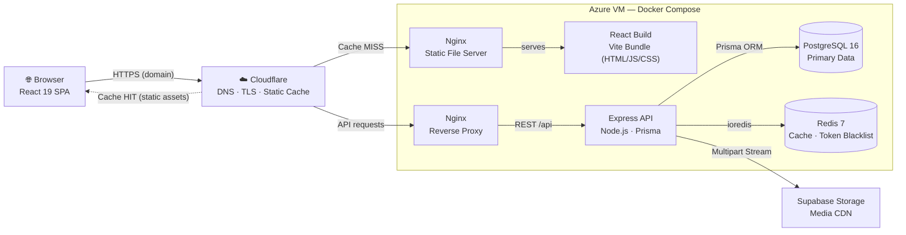
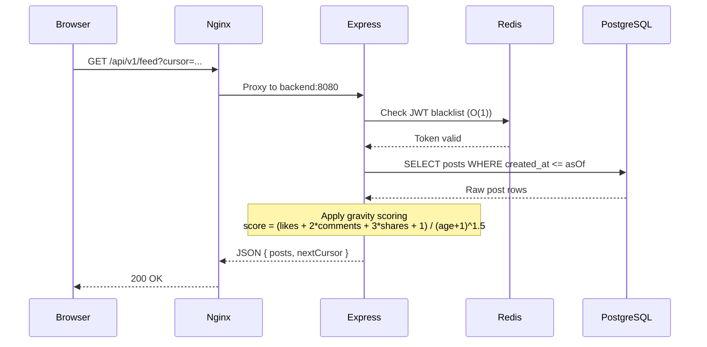

<div align="center">

# 📘 Facebook Clone — Feature Implementation

**A full-stack social media platform** built as part of the **CSE-326 Information System Design** course.  
Implements core Facebook feature: **Post Creation and Interaction**

[](https://nodejs.org)
[](https://www.typescriptlang.org)
[](https://react.dev)
[](https://www.prisma.io)
[](https://www.postgresql.org)
[](https://www.docker.com)
[](./LICENSE)

[Features](#-features) · [Architecture](#-architecture) · [Getting Started](#-getting-started) · [API Reference](#-api-reference)

</div>

---

## ✨ Features

| Feature | Description |
|---|---|
| 🔐 **Authentication** | JWT-based auth with HttpOnly cookies, Redis-backed token blacklisting for instant revocation |
| 📰 **Algorithmic Feed** | HackerNews-style gravity ranking with cursor-based snapshot pagination |
| 📝 **Posts** | Create, edit, delete posts with text, images, and videos |
| 🔄 **Post Sharing** | Share posts with custom text, engagement tracking, and graceful cascade handling |
| 💬 **Comments** | Threaded comments with full CRUD and automatic count tracking |
| ❤️ **Reactions** | Reaction with toggle/switch behavior |
| 🔔 **Notifications** | Poll-based notification system for reactions, comments, and shares |
| 🔍 **Search** | Case-insensitive pattern matching across users and public posts |
| 📁 **Media Upload** | Image/video uploads via Supabase Storage (10 MB limit) |
| 🔖 **Saved Posts** | Bookmark posts for later reading |

---

## 🏗️ Architecture

### System Overview



### Request Lifecycle



### Feed Ranking Algorithm

Posts are scored using a time-decay gravity model inspired by HackerNews:

$$\text{score} = \frac{\text{likes} + 2 \times \text{comments} + 3 \times \text{shares}}{(\text{ageHours} + 1)^{1.5}} \times \text{seededRandom}$$

Pagination uses base64url-encoded cursor tokens containing an `asOf` snapshot timestamp to guarantee stable, duplicate-free infinite scrolling.

---

## 🛠️ Tech Stack

<table>
<tr><th>Layer</th><th>Technology</th><th>Purpose</th></tr>
<tr><td rowspan="4"><strong>Frontend</strong></td><td>React 19</td><td>UI component framework</td></tr>
<tr><td>Vite 6</td><td>Build tool and dev server</td></tr>
<tr><td>TypeScript 5.7</td><td>Type safety</td></tr>
<tr><td>React Router 7</td><td>Client-side SPA routing</td></tr>
<tr><td rowspan="6"><strong>Backend</strong></td><td>Node.js 20 + Express 4</td><td>HTTP framework</td></tr>
<tr><td>Prisma 6</td><td>ORM, schema management, migrations</td></tr>
<tr><td>Zod</td><td>Runtime request validation</td></tr>
<tr><td>JWT + bcryptjs</td><td>Authentication and password hashing</td></tr>
<tr><td>Multer</td><td>Multipart file upload middleware</td></tr>
<tr><td>Helmet + express-rate-limit</td><td>Security headers and rate limiting</td></tr>
<tr><td rowspan="3"><strong>Data</strong></td><td>PostgreSQL 16</td><td>Primary relational database</td></tr>
<tr><td>Redis 7</td><td>JWT blacklisting and session cache</td></tr>
<tr><td>Supabase Storage</td><td>CDN-backed media object storage</td></tr>
<tr><td rowspan="3"><strong>Infra</strong></td><td>Docker + Docker Compose</td><td>Containerized deployment</td></tr>
<tr><td>Nginx</td><td>Reverse proxy and static file server</td></tr>
<tr><td>GitHub Actions</td><td>CI/CD pipeline</td></tr>
<tr><td rowspan="2"><strong>Testing</strong></td><td>Jest 29</td><td>Test runner</td></tr>
<tr><td>Supertest 7</td><td>HTTP integration testing</td></tr>
</table>

---

## 📂 Project Structure

```
├── .github/workflows/
│   └── deploy.yml               # CI/CD pipeline
├── backend/
│   ├── prisma/
│   │   └── schema.prisma        # 7 models, 2 enums
│   └── src/
│       ├── __tests__/            # Integration test suite
│       ├── config/               # DB, Redis, Supabase clients
│       ├── controllers/          # Route handlers + Zod validation
│       ├── middleware/           # JWT auth + error handling
│       ├── routes/               # Express route definitions
│       ├── services/             # Business logic layer
│       ├── utils/                # JWT & password helpers
│       ├── app.ts                # Express app configuration
│       └── index.ts              # Server entry point
├── frontend/
│   └── src/
│       ├── api/                  # Axios API client modules
│       ├── components/           # Reusable React components
│       ├── contexts/             # Auth context provider
│       ├── pages/                # Route page components
│       ├── App.tsx               # Root component with routing
│       └── index.css             # Global styles
├── Dockerfile.backend            # Multi-stage Node.js build
├── Dockerfile.frontend           # Multi-stage Vite → Nginx build
├── nginx.conf                    # TLS-enabled reverse proxy config
├── docker-compose.yml            # Local dev (DB + Redis)
├── docker-compose.prod.yml       # Full production stack
└── .env.example                  # Environment variables template
```

---

## 🚀 Getting Started

### Prerequisites

- **Docker Desktop** — for PostgreSQL and Redis containers
- **Node.js 18+** — runtime
- **npm** — package manager
- **Supabase account** — for media uploads ([free tier](https://supabase.com))

### 1. Clone & Configure

```bash
git clone https://github.com/RudraShivm/CSE-326-Facebook-Feat-Impl.git
cd CSE-326-Facebook-Feat-Impl

# Copy and edit environment variables
cp .env.example backend/.env
```

Fill in `backend/.env`:
```env
JWT_ACCESS_SECRET="<64-byte-hex>"     # node -e "console.log(require('crypto').randomBytes(64).toString('hex'))"
JWT_REFRESH_SECRET="<64-byte-hex>"
SUPABASE_URL="https://your-project.supabase.co"
SUPABASE_KEY="your-service-role-key"
```

### 2. Start Infrastructure

```bash
docker-compose up -d
```
> Starts **PostgreSQL** on `localhost:5432` and **Redis** on `localhost:6379`.  
> Automatically creates a separate `facebook_db_test` database for Jest.

### 3. Run Backend

```bash
cd backend
npm install
npm run dev          # Applies migrations + starts API on port 8080
```

### 4. Run Frontend

```bash
cd frontend
npm install
npm run dev          # Starts Vite dev server on port 5173
```

Your app is now live at **http://localhost:5173** 🎉

---

## 🐳 Production (Docker)

Build and launch the entire containerized stack:

```bash
docker-compose -f docker-compose.prod.yml up -d --build
```

| Service | Internal Port | Description |
|---|---|---|
| **Nginx** (Frontend) | `80` / `443` | Serves React SPA, proxies `/api/*` |
| **Express** (Backend) | `8080` | REST API (internal only) |
| **PostgreSQL** | `5432` | Primary database (internal only) |
| **Redis** | `6379` | Session cache (internal only) |

> Only Nginx is exposed to the host. All other services communicate over Docker's internal bridge network.

---

## 📡 API Reference

All endpoints are prefixed with `/api/v1`. Protected routes require valid JWT cookies.

<details>
<summary><strong>🔐 Authentication</strong></summary>

| Method | Endpoint | Auth | Description |
|---|---|---|---|
| `POST` | `/auth/register` | ✗ | Register a new user |
| `POST` | `/auth/login` | ✗ | Login and receive tokens |
| `POST` | `/auth/refresh` | ✗ | Refresh access token |
| `POST` | `/auth/logout` | ✓ | Blacklist current token |

</details>

<details>
<summary><strong>📝 Posts</strong></summary>

| Method | Endpoint | Auth | Description |
|---|---|---|---|
| `POST` | `/posts` | ✓ | Create a new post |
| `GET` | `/posts/:postId` | ✓ | Get a single post |
| `PATCH` | `/posts/:postId` | ✓ | Update own post |
| `DELETE` | `/posts/:postId` | ✓ | Delete own post |

</details>

<details>
<summary><strong>💬 Comments</strong></summary>

| Method | Endpoint | Auth | Description |
|---|---|---|---|
| `GET` | `/posts/:postId/comments` | ✓ | List comments (cursor pagination) |
| `POST` | `/posts/:postId/comments` | ✓ | Add a comment |
| `PATCH` | `/posts/:postId/comments/:commentId` | ✓ | Edit own comment |
| `DELETE` | `/posts/:postId/comments/:commentId` | ✓ | Delete own comment |

</details>

<details>
<summary><strong>❤️ Reactions</strong></summary>

| Method | Endpoint | Auth | Description |
|---|---|---|---|
| `POST` | `/posts/:postId/reactions` | ✓ | Toggle post reaction |
| `GET` | `/posts/:postId/reactions` | ✓ | Get post reactions |
| `POST` | `/comments/:commentId/reactions` | ✓ | Toggle comment reaction |

</details>

<details>
<summary><strong>📰 Feed & Search</strong></summary>

| Method | Endpoint | Auth | Description |
|---|---|---|---|
| `GET` | `/feed?limit=20&cursor=` | ✓ | Get algorithmic feed |
| `GET` | `/search?q=&type=all&page=1` | ✓ | Search users and posts |

</details>

<details>
<summary><strong>👤 Users</strong></summary>

| Method | Endpoint | Auth | Description |
|---|---|---|---|
| `GET` | `/users/:userId` | ✓ | Get user profile |
| `PUT` | `/users/:userId` | ✓ | Update profile |
| `GET` | `/users/:userId/posts` | ✓ | Get user's posts |
| `POST` | `/users/:userId/saved-posts/:postId` | ✓ | Save a post |
| `DELETE` | `/users/:userId/saved-posts/:postId` | ✓ | Unsave a post |
| `GET` | `/users/:userId/saved-posts` | ✓ | Get saved posts |
| `POST` | `/users/:userId/block` | ✓ | Block a user |
| `DELETE` | `/users/:userId/block/:blockedId` | ✓ | Unblock a user |

</details>

<details>
<summary><strong>🔔 Notifications</strong></summary>

| Method | Endpoint | Auth | Description |
|---|---|---|---|
| `GET` | `/notifications` | ✓ | Get notifications (paginated) |
| `GET` | `/notifications/unread-count` | ✓ | Get unread count |
| `PUT` | `/notifications/:id/read` | ✓ | Mark one as read |
| `PUT` | `/notifications/read-all` | ✓ | Mark all as read |

</details>

<details>
<summary><strong>📁 Storage</strong></summary>

| Method | Endpoint | Auth | Description |
|---|---|---|---|
| `POST` | `/storage/upload` | ✓ | Upload media file (10 MB max) |

</details>


---

## 📝 License

This project is licensed under the [MIT License](./LICENSE).
